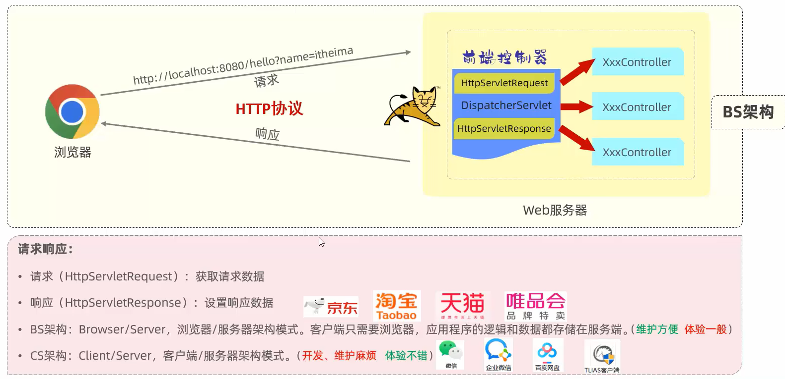
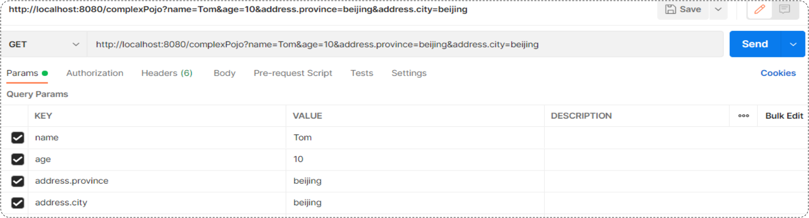
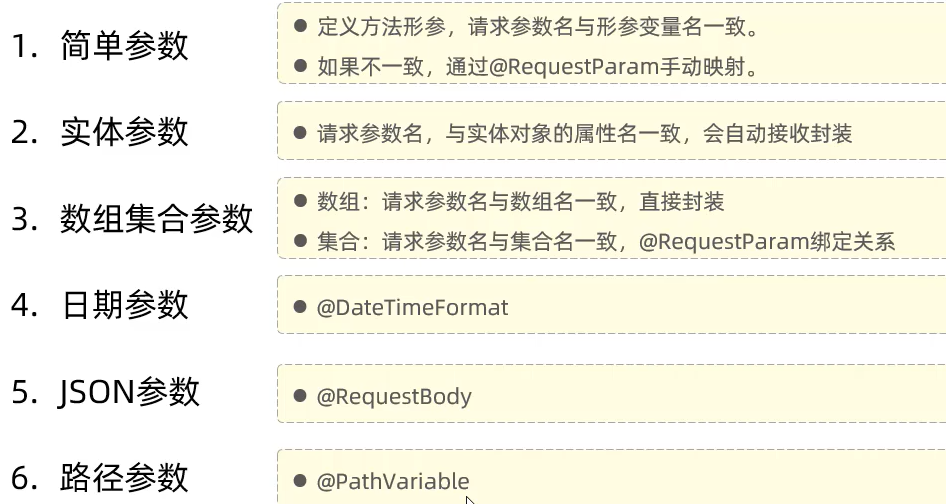
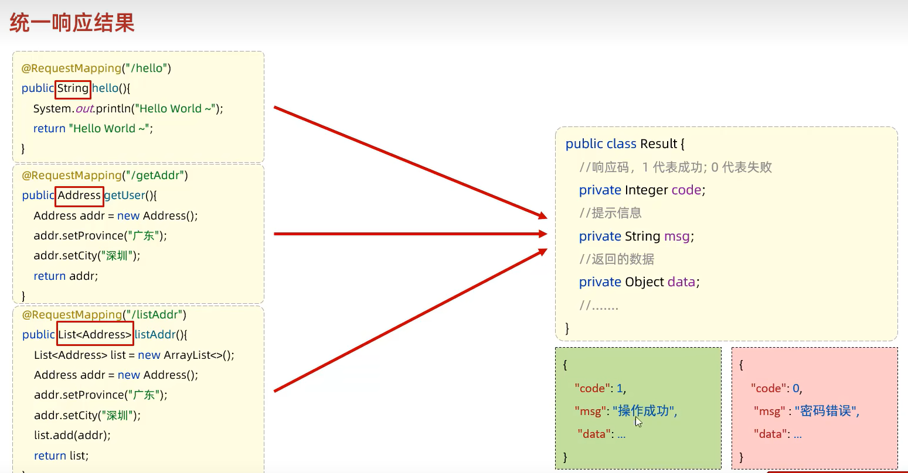
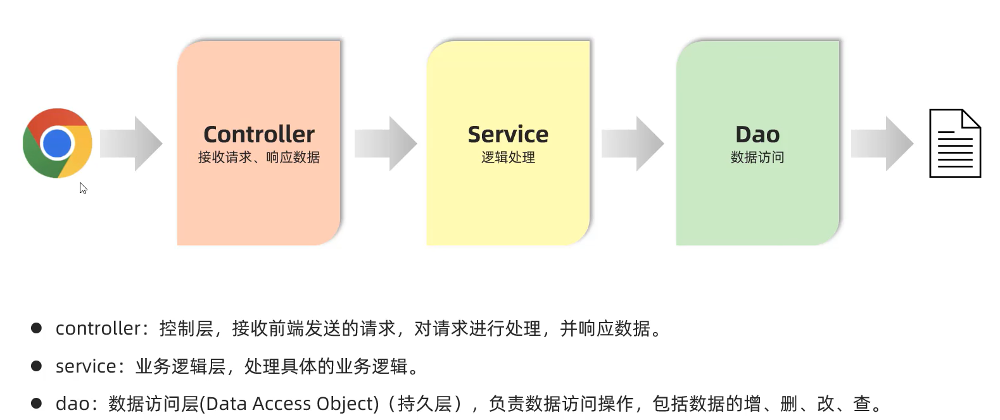
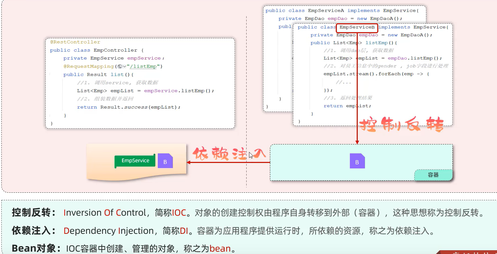
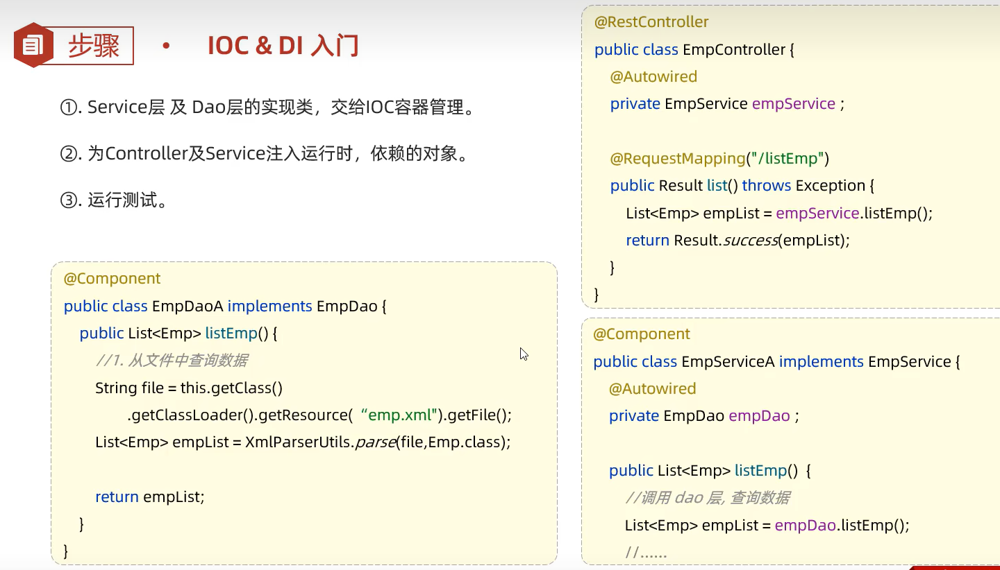
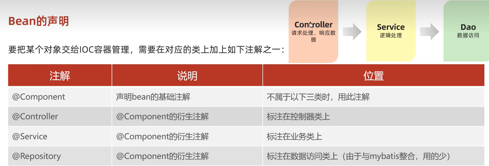

# 第3 章 请求响应


tomcat不能识别我们编写的 controller 程序，但是能够通过servlet实现控制 - `DispatcherServlet`(前端控制器)
![[Pasted image 20241228151833.png]]

## 请求
### Postman
- Postman是一款功能强大的网页调试与发送网页HTTP请求的Chrome插件。
- 作用：常用于进行*接口测试*
	- 因为前后端分离开发，后端程序员看不到前端界面，无法测试后端代码
### 简单参数
1. 原始方式： 在原始的web程序中，获取请求参数，需要通过 `HttpServletRequest` 对象手动获取。
2. SpringBoot 方式： 简单参数：参数名与形参变量名相同，定义形参即可接收参数。会自动进行类型转换
    ```java
    // 原始方式
package com.itheima.springboot_web_req_resp.com.itheima;

import jakarta.servlet.http.HttpServletRequest;
import org.springframework.web.bind.annotation.RequestMapping;
import org.springframework.web.bind.annotation.RestController;

@RestController
public class RequestController {

    @RequestMapping("/simpleParam")
    public String simpleParam(HttpServletRequest request) {
        String name = request.getParameter("name");
        String ageStr = request.getParameter("age");

        int age = Integer.parseInt(ageStr);
        System.out.println(name + ": " + age);
        return "OK";
    }
}
// 注意请求中的参数名和代码中的参数名必须相同！！！
    ```

```java
//spring 方式
    @RequestMapping("/simpleParam")
    public String simpleParam(String name, Integer age) {
        System.out.println(name + ": " + age);
        return "OK";
    }
```
1. 简单参数：如果方法形参名称与请求参数名称*不匹配（此时不会报错，而是指返回能够匹配的参数。不能匹配则返回null）*，可以使用Spring提供的 `@RequestParam` 完成映射。
	- 在方法形参前面加上 @RequestParam 然后通过value属性执行请求参数名，从而完成*映射*。代码如下
    ```java
@RestController
public class RequestController {
    // http://localhost:8080/simpleParam?name=Tom&age=20
    // 请求参数名：name

    //springboot方式
    @RequestMapping("/simpleParam")
    public String simpleParam(@RequestParam("name") String username , Integer age ){
        System.out.println(username+"  :  "+age);
        return "OK";
    }
}
    ```
    -  `@RequestParam` 中的 required 属性*默认为true* ，代表该请求参数必须传递，如果不传递将报错。 如果该参数是可选的，可以将 required 属性设置为 false。

### 实体参数
#### 简单实体对象
在使用简单参数做为数据传递方式时，前端传递了多少个请求参数，后端controller方法中的*形参*就要书写多少个。如果请求参数比较多，通过上述的方式一个参数一个参数的接收，会比较繁琐。

请求参数名与形参对象属性名相同，定义`POJO`接收即可
```java
public class User {    
    private String name;   
    private Integer age;
}
@RequestMapping("/simplePojo")
public String simplePojo(User user){    
    System.out.println(user);
    return "OK";
    }
```

#### 复杂实体对象
请求参数名与形参对象属性名相同，按照对象层次结构关系即可接收嵌套POJO属性参数。
```java
public class Address {
    private String province;
    private String city;
}

public class User {    
    private String name;   
    private Integer age;
    private Address address;  // 来自另一个类
}
@RequestMapping("/simplePojo")
public String simplePojo(User user){    
    System.out.println(user);
    return "OK";
    }
```


![[Pasted image 20241228162745.png]]

### 数组集合参数
前端复选框中的值是可以选择多个的，为了提交多个值，我们需要数组集合。有两种方式：数组和集合
#### 数组参数
![[Pasted image 20241228163727.png]]
请求参数名与形参数组名称相同且请求参数为多个，直接使用数组类型形参接收参数。
```java
//Controller方法：
@RequestMapping("/arrayParam")
public String arrayParam(String[] hobby){
    System.out.println(Arrays.toString(hobby));
    return "OK";
    }
```
#### 集合参数
请求参数名与形参集合名称相同且请求参数为多个，通过 `@RequestParam` 绑定参数关系

> *默认情况下*，请求中参数名相同的多个值，是封装到数组。如果要封装到集合，要使用@RequestParam绑定参数关系
```java
@RequestMapping("/listParam")
public String listParam(@RequestParam List<String> hobby){
    System.out.println(hobby);
    return "OK";
    }

```
### 日期参数

- @DateTimeFormat注解的pattern属性中指定了哪种日期格式，前端的日期参数就必须按照指定的格式传递。
- 后端controller方法中，需要使用Date类型或LocalDateTime类型，来封装传递的参数。
![[Pasted image 20241228165406.png]]
```java
@RequestMapping("/dateParam")
public String dateParam(@DateTimeFormat(pattern = "yyyy-MM-dd HH:mm:ss") LocalDateTime updateTime){
    System.out.println(updateTime);
    return "OK";
    }
```

### Json参数
比较复杂的参数，前后端通过会使用JSON格式的数据进行传输。 （JSON是开发中最常用的前后端数据交互方式）

JSON 参数：JSON 数据键名与形参对象属性名相同，定义 POJO 类型形参即可接收参数，需要使用 `@RequestBody` 标识。
- - @RequestBody注解：将JSON数据映射到形参的实体类对象中（JSON中的key和实体类中的属性名保持一致）

1. Postman在发送请求时，如何传递json格式的请求参数
2. 在服务端的controller方法中，如何接收json格式的请求参数

![[Pasted image 20241228165946.png]]

服务端Controller方法接收JSON格式数据：

- 传递json格式的参数，在Controller中会使用*实体类*进行封装。
- 封装规则：**JSON数据键名与*形参对象属性名*相同，定义POJO类型形参即可接收参数。需要使用 @RequestBody标识。**
![[Pasted image 20241228170040.png]]

```java
@RestController
public class RequestController {
    //JSON参数
    @RequestMapping("/jsonParam")
    public String jsonParam(@RequestBody User user){ ///
        System.out.println(user);
        return "OK";
    }
}
```

### 路径参数
路径参数：通过请求 URL 直接传递参数，使用 `{…}` (作为路径参数传入) 来标识该路径参数，需要使用 `@PathVariable` 获取路径参数，并将形参绑定到路径参数。

后端的controller方法中，如何接收路径参数。

```java
@RequestMapping("/path/{id}/{name}")
public String pathParam2(
		@PathVariable Integer id, 
		@PathVariable String name){
    System.out.println(id+ " : " +name);
    return "OK";
    }
```



## 响应
请求响应模式（有请求就有响应）：
我们写的Controller类由两种组成，前面使用的一直是接收请求的 RequestController。除此之外Controller还可以进行响应。

在我们前面所编写的controller方法中，都已经设置了响应数据。
我们在controller方法中return的结果，是通过 `@ResponseBody` 注解响应给浏览器的。
![[Pasted image 20241228172433.png]]


`@ResponseBody`
- 类型：方法注解、类注解
- 位置：Controller *方法*上 / *类*上
- 作用：将方法返回值直接响应，如果返回值类型是 实体对象 / 集合 ，将会转换为 JSON 格式响应
- ***说明***：`@RestController = @Controller + @ResponseBody`;
- 一个问题，我们在前面所编写的这些Controller方法中，*返回值各种各样*，没有任何的规范。
- 不便管理，需要统一响应结果，`Result（code、msg、data)`
	- 在真实的项目开发中，无论是哪种方法，我们都会定义一个统一的返回结果。方案如下：

（这些public方法就是暴露在外面的*功能接口*，注解中的路径就是这个接口的访问路径。
> 前端：只需要按照统一格式的返回结果进行解析(*仅一种解析方案*)，就可以拿到数据。

```java
public class Result {
    private Integer code;//响应码，1 代表成功; 0 代表失败
    private String msg;  //响应码 描述字符串
    private Object data; //返回的数据

    public Result() { }
    public Result(Integer code, String msg, Object data) {
        this.code = code;
        this.msg = msg;
        this.data = data;
    }

    public Integer getCode() {
        return code;
    }

    public void setCode(Integer code) {
        this.code = code;
    }

    public String getMsg() {
        return msg;
    }

    public void setMsg(String msg) {
        this.msg = msg;
    }

    public Object getData() {
        return data;
    }

    public void setData(Object data) {
        this.data = data;
    }

    //增删改 成功响应(不需要给前端返回数据)
    public static Result success(){
        return new Result(1,"success",null);
    }
    //查询 成功响应(把查询结果做为返回数据响应给前端)
    public static Result success(Object data){
        return new Result(1,"success",data);
    }
    //失败响应
    public static Result error(String msg){
        return new Result(0,msg,null);
    }
}
```
**注意这里的静态方法！！！ 在Controller类中直接使用静态方法，而不是创建对象。**

```java
// controller
@RestController
public class ResponseController { 
    //响应统一格式的结果
    @RequestMapping("/hello")
    public Result hello(){
        System.out.println("Hello World ~");
        //return new Result(1,"success","Hello World ~");
        return Result.success("Hello World ~");
    }

    //响应统一格式的结果
    @RequestMapping("/getAddr")
    public Result getAddr(){
        Address addr = new Address();
        addr.setProvince("广东");
        addr.setCity("深圳");
        return Result.success(addr);
    }

    //响应统一格式的结果
    @RequestMapping("/listAddr")
    public Result listAddr(){
        List<Address> list = new ArrayList<>();

        Address addr = new Address();
        addr.setProvince("广东");
        addr.setCity("深圳");

        Address addr2 = new Address();
        addr2.setProvince("陕西");
        addr2.setCity("西安");

        list.add(addr);
        list.add(addr2);
        return Result.success(list);
    }
}
```


### 案例
Springboot 项目的静态资源(html，css，js等前端资源)默认存放目录为：`classpath:/static 、 classpath:/public、 classpath:/resources`

```java
@RestController
public class EmpController {
    @RequestMapping("/listEmp")
    public Result list(){
        //1. 加载并解析emp.xml -- > 拿到类路径下的resource中的资源文件
        String file = this.getClass().getClassLoader().getResource("emp.xml").getFile();
        //System.out.println(file);
        List<Emp> empList = XmlParserUtils.parse(file, Emp.class);

        //2. 对数据进行转换处理 - gender, job
        empList.stream().forEach(emp -> {
            //处理 gender 1: 男, 2: 女
            String gender = emp.getGender();
            if("1".equals(gender)){
                emp.setGender("男");
            }else if("2".equals(gender)){
                emp.setGender("女");
            }

            //处理job - 1: 讲师, 2: 班主任 , 3: 就业指导
            String job = emp.getJob();
            if("1".equals(job)){
                emp.setJob("讲师");
            }else if("2".equals(job)){
                emp.setJob("班主任");
            }else if("3".equals(job)){
                emp.setJob("就业指导");
            }
        });
        //3. 响应数据
        return Result.success(empList);
    }
}

```

以下是Postman显示的返回值，根据 Result 类的静态方法并结合VUE的知识，思考界面是如何呈现的
![[Pasted image 20241228212340.png]]
![[Pasted image 20241228212431.png]]

```java
    //增删改 成功响应(不需要给前端返回数据)
    public static Result success(){
        return new Result(1,"success",null);
    }
    //* 查询 成功响应(把查询结果做为返回数据响应给前端)
    public static Result success(Object data){
        return new Result(1,"success",data);
    }
    //失败响应
    public static Result error(String msg){
        return new Result(0,msg,null);
    }
```


## 分层解耦
当前程序的这个业务逻辑还是比较简单的，如果业务逻辑再稍微复杂一点，我们会看到Controller方法的代码量就很大了。
![[Pasted image 20241228212832.png]]

- 当我们要修改操作数据部分的代码，需要改动Controller
- 当我们要完善逻辑处理部分的代码，需要改动Controller
- 当我们需要修改数据响应的代码，还是需要改动Controller

### 三层架构

- 复用性差、难以维护 VS 复用性强、便于维护、利于拓展

- 前端发起的请求，由Controller层接收（Controller响应数据给前端）
- Controller层调用*Service*层来进行逻辑处理（Service层处理完后，把处理结果返回给Controller层）
- Serivce层调用*Dao*层（逻辑处理过程中需要用到的一些数据要从Dao层获取）
- Dao层操作文件中的数据 或者 数据库中的数据（Dao拿到的数据会返回给Service层）

> 思考：按照三层架构的思想，如何要对业务逻辑(Service层)进行变更，会影响到Controller层和Dao层吗？
> 
> 答案：不会影响。 （程序的扩展性、维护性变得更好了）

### 代码拆分
我们使用三层架构思想，来改造下之前的程序：
- 控制层*包名*：xxxx.controller
- 业务逻辑层*包名*：xxxx.service
- 数据访问层*包名*：xxxx.dao
![[Pasted image 20241228213336.png]]

单一职责原则：
![[Pasted image 20241228220019.png]]

### 分层解耦
- *内聚*：软件中各个功能模块内部的功能联系，emp类只负责跟员工有关的逻辑。
- *耦合*：衡量软件中各个层/模块之间的依赖、**关联的程度**。
	- 例如在controller类中创建了service对象，当service类名发生变动时，我们需要在controller中做一处修改（使用了接口声明成员变量）
- 软件设计原则：***高内聚低耦合***。

![[Pasted image 20241228220528.png]]
![[Pasted image 20241228220554.png]]
**只要new了对象，就表示两个类之间存在耦合， 因此解耦合的关键在于避免创建对象**




- 此时，就存在另一个问题了，不能new，就意味着没有业务层对象（程序运行就报错-空指针异常），怎么办呢？
    - 我们的解决思路是：
        - 提供一个容器，*容器中存储一些对象*(例：EmpService对象)
        - controller程序从容器中获取EmpService类型的对象

我们想要实现上述解耦操作，就涉及到Spring中的两个核心概念：

- **控制反转：** ***Inversion Of Control***，简称IOC。对象的*创建控制权*由程序自身转移到*外部（容器）*，这种思想称为控制反转。
    > 对象的创建权由程序员主动创建转移到容器(由容器创建、管理对象)。这个容器称为：IOC容器或Spring容器
    
- **依赖注入：** ***Dependency Injection***，简称DI。容器为应用程序提供运行时，所依赖的资源，称之为依赖注入。
    > 程序运行时需要某个资源，此时容器就为其提供这个资源。
    > 
    > 例：EmpController程序运行时需要EmpService对象，Spring容器就为其提供并注入EmpService对象
    

- IOC*容器中创建、管理的对象*，称之为：**bean对象**

##### 步骤 1：删除Controller层、Service层中new对象的代码
![[Pasted image 20241229114709.png]]

##### 步骤 2：Service层及Dao层的实现类，交给IOC容器管理
![[Pasted image 20241229114541.png]]
交给容器管理的意思是，这个类中需要new对象的地方，由IOC容器负责，同样通过注解标注依赖注入的位置。

##### 步骤 3：为Controller及Service注入运行时依赖的对象
![[Pasted image 20241229115537.png]]

### IOC & DI入门

- `@Component` 将当前类交给 IOC 容器管理，成为 IOC 容器中的 *bean对象*
- `@Autowired` 运行时，IOC 容器会提供该类型的 bean 对象，并赋值给该变量，依赖注入

### IOC详解


控制反转，实际就是将创建对象的控制权交给IOC容器

注意事项：
- 更推荐使用三个衍生注解，只有当某个类（例如工具类）无法被归类为CSD之一时，才用 Component。**但是声明Controller中的注解时，只能用Controller**
- 但是由于 `@RestController` 已经包含了 `@Controller`, 因此我们不需要使用第一个衍生注解 --> 也就是说，Controller类早已交给了IOC容器管理
- 声明 *bean* 的时候，可以通过 `value` 属性指定 bean 的名字，如果没有指定，*默认为类名首字母小写*。
- 使用以上四个注解都可以声明 bean ，但是在 springboot 集成 web 开发中，声明控制器 bean 只能用 `@Controller`。
- 也可以命名注解 `@Service(value = "lalala")`

![[Pasted image 20241229125318.png]]

#### 组件扫描
- 前面声明 bean 的四大注解，要想*生效*，还需要被组件扫描注解 `@ComponentScan` 扫描。
- `@ComponentScan` 注解虽然没有显式配置，但是实际上已经包含在了启动类声明注解 。 `@SpringBootApplication` 中，*默认扫描的范围*是启动类所在包及其子包。

![[Pasted image 20241229130358.png]]

![[Pasted image 20241229130407.png]]

推荐做法是，将我们的controller，service和dao这些包放在引导类所在的包的子包下，这样我们定义的bean就会被自动扫描到

- 解决方案：手动添加@ComponentScan注解，指定要扫描的包 （==仅做了解，不推荐==）
![[Pasted image 20241229130628.png]]

### DI详解
![[Pasted image 20241229131115.png]]
![[Pasted image 20241229131122.png]]
1. `@Autowired` 注解，默认是按照*类型*进行，如果存在*多个相同类型的 bean* ，将会报出错误（静态检测和执行都会报错）。
2. 通过以下几种方案来解决：
    - `@Primary` 当存在多个相同类型的Bean注入时，加上@Primary注解，来确定默认的实现。
    ```java
    @Primary // 定义在 service 层，让当前bean生效
    @Service // IOC使用当前bean对象进行注入
    public class EmpServiceA implements EmpService {
    }
    ```
    - `@Autowired + @Qualifier("bean的名称")` 指定当前要注入的bean对象。 在@Qualifier的value属性中，指定注入的bean的名称。
    ```java
    @RestController
    public class EmpController {
        @Autowired   
        @Qualifier("empServiceA") // 定义在 Controller 层， 指定使用IOC容器中名字叫 empServiceA 的bean对象进行注入
        private EmpService empService ;
    }
    ```
    - `@Resource(name="bean的名称")`
    ```java
    @RestController
    public class EmpController {
        @Resource(name = "empServiceB") //  定义在 Controller 层  
        private EmpService empService ;
    ```


`@Resource` 与 `@Autowired` 区别
- `@Autowired` 是 spring 框架提供的注解，而`@Resource` 是 *JDK* 提供的注解。
- `@Autowired` 默认是按照*类型*注入，而`@Resource` 默认是按照*名称*注入。
