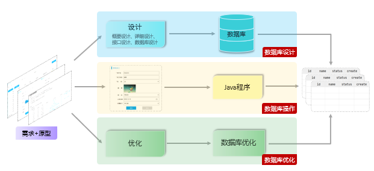

# 第 4 章 MySQL
## 数据库
1. 数据库：DataBase（DB），是存储和管理数据的仓库。
2. 数据库管理系统：DataBase Management System  (DBMS)，操纵和管理数据库的大型软件。
3. SQL：Structured Query Language，操作关系型数据库的编程语言，定义了一套操作关系型数据库统一标准。

## MySQL概述
```bash

net start mysql  // 启动mysql服务

net stop mysql  // 停止mysql服务

mysqladmin -u root password 1234
```

### 登录
右键开始菜单，选择`命令提示符`，打开黑框。

在黑框中输入，`mysql -uroot -p1234`，回车，出现下图且左下角为`mysql>`，则登录成功。

```

mysql -uroot -p1234

```

```
mysql -u用户名 -p密码 [-h数据库服务器的IP地址 -P端口号]
```

> -h 参数不加，默认连接的是本地 127.0.0.1 的MySQL服务器
> 
> -P 参数不加，默认连接的端口号是 3306


1. 数据模型：关系型数据库（RDBMS）: 建立在关系模型基础上，由多张相互连接的二维表组成的数据库。
2. SQL: 一门操作关系型数据库的编程语言，定义操作所有关系型数据库的统一标准。
    - SQL语句可以单行或多行书写，以***分号***结尾。
    - SQL语句可以使用空格/缩进来增强语句的可读性。
    - MySQL数据库的SQL语句不区分大小写。
    - 注释：
        - 单行注释：-- 注释内容 或 # 注释内容(MySQL特有)
        - 多行注释： /* 注释内容 * /
3. SQL 分类

| **分类** | **全称**                    | **说明**                                               |
| -------- | --------------------------- | ------------------------------------------------------ |
| DDL      | Data Definition  Language   | 数据定义语言，用来定义数据库对象(数据库，表，字段)     |
| DML      | Data Manipulation  Language | 数据操作语言，用来对数据库表中的数据进行增删改         |
| DQL      | Data Query Language         | 数据查询语言，用来查询数据库中表的记录                 |
| DCL      | Data Control  Language      | 数据控制语言，用来创建数据库用户、控制数据库的访问权限 |

![[Pasted image 20241229144559.png]]

### 项目开发流程


## 数据库设计-DDL
DDL 英文全称是 Data Definition Language，数据定义语言，用来定义数据库对象(数据库、表)。
### DDL（数据库操作）
1. 查询：
    - 查询所有数据库：`show databases;`
    - 查询当前数据库：`select database();`
2. 使用：
    - 使用数据库：`use  数据库名 ;`
3. 创建
    - 创建数据库： `create  database [ if  not  exists ]   数据库名 ;`
4. 删除:
    - 删除数据库：`drop  database [ if exists ]   数据库名 ;`
5. 上述语法中的`database`，也可以替换成 `schema`。如：`create schema  db01;`


### 表（创建、查询、修改、删除）
1. 创建
    ```sql
    create table  表名(
        字段1  字段类型  [ 约束 ]  [ comment  字段1注释 ] ,
        ......
        字段n  字段类型  [ 约束 ]  [ comment  字段n注释 ] 
    ) [ comment  表注释 ] ;
    ```
2. 约束
    - 概念：约束是作用于表中字段上的规则，用于限制存储在表中的数据。
    - 目的：保证数据库中数据的正确性、有效性和完整性。

| **约束** | **描述**                                         | **关键字**  |
| -------- | ------------------------------------------------ | ----------- |
| 非空约束 | 限制该字段值不能为null                           | not null    |
| 唯一约束 | 保证字段的所有数据都是唯一、不重复的             | unique      |
| 主键约束 | 主键是一行数据的唯一标识，要求非空且唯一         | primary key |
| 默认约束 | 保存数据时，如果未指定该字段值，则采用默认值     | default     |
| 外键约束 | 让两张表的数据建立连接，保证数据的一致性和完整性 | foreign key |

1. 数据类型 : MySQL 中的数据类型有很多，主要分为三类：数值类型、字符串类型、日期时间类型。
2. create_time：记录的是当前这条数据插入的时间。 update_time：记录当前这条数据最后更新的时间。
3. 查询
    - 查询当前数据库所有表：`show tables`;
    - 查询表结构：`desc  表名`;
    - 查询建表语句：`show create table 表名`;
4. 修改
    - 添加字段：`alter table 表名  add  字段名  类型(长度)  [comment  注释]  [约束]`;
    - 修改字段类型：`alter table 表名 modify  字段名  新数据类型(长度)`;
    - 修改字段名和字段类型：`alter table 表名 change  旧字段名  新字段名  类型 (长度)  [comment 注释]  [约束]`;
    - 删除字段：`alter table 表名 drop  column 字段名`;
    - 修改表名： `rename table 表名 to  新表名`;
5. 删除
    - 删除表：`drop table [ if exists ] 表名`;
    - 在删除表时，表中的全部数据也会被删除。
#### 数值类型
| 类型        | 大小   | 有符号(SIGNED)范围                                    | 无符号(UNSIGNED)范围                                       | 描述               |
| ----------- | ------ | ----------------------------------------------------- | ---------------------------------------------------------- | ------------------ |
| TINYINT     | 1byte  | (-128，127)                                           | (0，255)                                                   | 小整数值           |
| SMALLINT    | 2bytes | (-32768，32767)                                       | (0，65535)                                                 | 大整数值           |
| MEDIUMINT   | 3bytes | (-8388608，8388607)                                   | (0，16777215)                                              | 大整数值           |
| INT/INTEGER | 4bytes | (-2147483648，2147483647)                             | (0，4294967295)                                            | 大整数值           |
| BIGINT      | 8bytes | (-2^63，2^63-1)                                       | (0，2^64-1)                                                | 极大整数值         |
| FLOAT       | 4bytes | (-3.402823466 E+38，3.402823466351 E+38)              | 0 和 (1.175494351  E-38，3.402823466 E+38)                 | 单精度浮点数值     |
| DOUBLE      | 8bytes | (-1.7976931348623157 E+308，1.7976931348623157 E+308) | 0 和  (2.2250738585072014 E-308，1.7976931348623157 E+308) | 双精度浮点数值     |
| DECIMAL     |        | 依赖于M(精度)和D(标度)的值                            | 依赖于M(精度)和D(标度)的值                                 | 小数值(精确定点数) |

```sql
示例: 
    年龄字段 ---不会出现负数, 而且人的年龄不会太大
	age tinyint unsigned
	
	分数 ---总分100分, 最多出现一位小数
	score double(4,1)
```

#### 字符串类型
| 类型       | 大小                  | 描述                         |
| ---------- | --------------------- | ---------------------------- |
| CHAR       | 0-255 bytes           | 定长字符串(需要指定长度)     |
| VARCHAR    | 0-65535 bytes         | 变长字符串(需要指定长度)     |
| TINYBLOB   | 0-255 bytes           | 不超过255个字符的二进制数据  |
| TINYTEXT   | 0-255 bytes           | 短文本字符串                 |
| BLOB       | 0-65 535 bytes        | 二进制形式的长文本数据       |
| TEXT       | 0-65 535 bytes        | 长文本数据                   |
| MEDIUMBLOB | 0-16 777 215 bytes    | 二进制形式的中等长度文本数据 |
| MEDIUMTEXT | 0-16 777 215 bytes    | 中等长度文本数据             |
| LONGBLOB   | 0-4 294 967 295 bytes | 二进制形式的极大文本数据     |
| LONGTEXT   | 0-4 294 967 295 bytes | 极大文本数据                 |

char 与 varchar 都可以描述字符串，char是定长字符串，指定长度多长，就占用多少个字符，和字段值的长度无关 。而varchar是变长字符串，指定的长度为最大占用长度 。相对来说，*char的性能会更高些*。

```sql
示例： 
    用户名 username ---长度不定, 最长不会超过50
	username varchar(50)
	
	手机号 phone ---固定长度为11
	phone char(11)
```

#### 日期时间类型
| 类型      | 大小 | 范围                                       | 格式                | 描述                     |
| --------- | ---- | ------------------------------------------ | ------------------- | ------------------------ |
| DATE      | 3    | 1000-01-01 至  9999-12-31                  | YYYY-MM-DD          | 日期值                   |
| TIME      | 3    | -838:59:59 至  838:59:59                   | HH:MM:SS            | 时间值或持续时间         |
| YEAR      | 1    | 1901 至 2155                               | YYYY                | 年份值                   |
| DATETIME  | 8    | 1000-01-01 00:00:00 至 9999-12-31 23:59:59 | YYYY-MM-DD HH:MM:SS | 混合日期和时间值         |
| TIMESTAMP | 4    | 1970-01-01 00:00:01 至 2038-01-19 03:14:07 | YYYY-MM-DD HH:MM:SS | 混合日期和时间值，时间戳 |

```sql
示例: 
	生日字段  birthday ---生日只需要年月日  
	birthday date
	
	创建时间 createtime --- 需要精确到时分秒
	createtime  datetime
```

### 查询
关于表结构的查询操作，工作中一般都是直接基于图形化界面操作。

**查询当前数据库所有表**:
`show tables;`

**查看指定表结构**

```mysql
desc 表名 ;
#可以查看指定表的字段、字段的类型、是否可以为NULL、是否存在默认值等信息
```


**查询指定表的建表语句**

```mysql
show create table 表名 ;
```

### 修改
> 关于表结构的修改操作，工作中一般都是直接基于**图形化界面操作**。 

**添加字段**

```sql
alter table 表名 add  字段名  类型(长度)  [comment 注释]  [约束];
```

案例： 为tb_emp表添加字段qq，字段类型为 varchar(11)

```sql
alter table tb_emp add  qq  varchar(11) comment 'QQ号码';
```

**修改数据类型**

```mysql
alter table 表名 modify  字段名  新数据类型(长度);
```

```sql
alter table 表名 change  旧字段名  新字段名  类型(长度)  [comment 注释]  [约束];
```

案例：修改qq字段的字段类型，将其长度由11修改为13

```sql
alter table tb_emp modify qq varchar(13) comment 'QQ号码';
```

案例：修改qq字段名为 qq_num，字段类型varchar(13)

```sql
alter table tb_emp change qq qq_num varchar(13) comment 'QQ号码';
```

**删除字段**

```sql
alter table 表名 drop 字段名;
```

案例：删除tb_emp表中的qq_num字段

```sql
alter table tb_emp drop qq_num;
```

**修改表名**

```sql
rename table 表名 to  新表名;
```

案例：将当前的tb_emp表的表名修改为emp

```mysql
rename table tb_emp to emp;
```

删除表语法：

```sql
drop  table [ if exists ]  表名;
```

> if exists ：只有表名存在时才会删除该表，表名不存在，则不执行删除操作(如果不加该参数项，删除一张不存在的表，执行将会报错)。

案例：如果tb_emp表存在，则删除tb_emp表

~~~mysql
drop table if exists tb_emp;  -- 在删除表时，表中的全部数据也会被删除。
~~~

## 数据库操作-DML
DML 英文全称是 Data Manipulation Language (数据操作语言)，用来对数据库中表的数据记录进行增、删、改操作。
### 添加数据（INSERT）
- 指定字段添加数据：`insert into 表名 (字段名1, 字段名2)  values (值1, 值2)`;
- 全部字段添加数据：`insert into 表名 values (值1, 值2, ...)`;
- *批量*添加数据（指定字段）：`insert into 表名 (字段名1, 字段名2)  values (值1, 值2), (值1, 值2)`;
- 批量添加数据（全部字段）：`insert into 表名 values (值1, 值2, ...), (值1, 值2, ...)`;

注意事项：
1. 插入数据时，指定的字段顺序需要与值的顺序是一一对应的。
2. *字符串*和*日期*型数据应该包含在*引号中*。
3. 插入的数据大小，应该在字段的规定范围内。
### 修改数据（UPDATE）
- 修改数据：`update  表名  set  字段名1 = 值1 , 字段名2 = 值2 , .... [ where  条件 ] `;

注意事项：
- 修改语句的条件可以有，也可以没有，如果没有条件，则会修改整张表的所有数据。

案例1：将tb_emp表中id为1的员工，姓名name字段更新为'张三'

```sql
update tb_emp set name='张三',update_time=now() where id=1;
```

案例2：将tb_emp表的*所有员工*入职日期更新为 `'2010-01-01'`

```sql
update tb_emp set entrydate='2010-01-01',update_time=now();
```

### 删除数据（DELETE）
- 删除数据：`delete  from  表名  [ where  条件 ]`;

注意事项：
- DELETE 语句的条件可以有，也可以没有，如果*没有条件，则会删除整张表的所有数据*。
- DELETE 语句*不能删除某一个字段的值* ( 如果要操作，可以使用 UPDATE，将该字段的值置为 NULL )。

案例1：删除tb_emp表中id为1的员工

```sql
delete from tb_emp where id = 1;
```

案例2：删除tb_emp表中所有员工

```sql
delete from tb_emp;
```

## 数据库操作-DQL
- DQL 英文全称是 *Data Query Language* (数据查询语言)，用来查询数据库表中的记录。
- 关键字：SELECT
- ![[635bf277d243ee40fccf508d255235c.png]]

group by 和 having 需要一起用

### 基本查询
语法：
- 查询多个字段：`select  字段1, 字段2, 字段3  from   表名`;
- 查询所有字段（通配符）：`select  *  from   表名`;
- 设置别名：`select  字段1  [ as  别名1 ] , 字段2  [ as  别名2 ]   from   表名`;
- 去除重复记录：`select  distinct  字段列表  from   表名`;

注意事项：
- \* 号代表查询所有字段，在实际开发中尽量少用（不直观、影响效率）。
### 条件查询（where）
条件查询：`select  字段列表  from   表名   where   条件列表`;
学习条件查询就是学习条件的构建方式，而在SQL语句当中构造条件的运算符分为两类：

- 比较运算符
- 逻辑运算符

常用的比较运算符如下: 

| **比较运算符**       | **功能**                                 |
| -------------------- | ---------------------------------------- |
| >                    | 大于                                     |
| >=                   | 大于等于                                 |
| <                    | 小于                                     |
| <=                   | 小于等于                                 |
| =                    | 等于                                     |
| <> 或 !=             | 不等于                                   |
| between ...  and ... | 在某个范围之内(含最小、最大值)           |
| in(...)              | 在in之后的列表中的值，多选一             |
| like 占位符          | 模糊匹配(_匹配单个字符, %匹配任意个字符) |
| is null              | 是null                                   |

常用的逻辑运算符如下:

| **逻辑运算符** | **功能**                    |
| -------------- | --------------------------- |
| and 或 &&      | 并且 (多个条件同时成立)     |
| or 或 \|\|     | 或者 (多个条件任意一个成立) |
| not 或 !       | 非 , 不是                   |

### 分组查询（group by）
#### 聚合函数
- 介绍：将一列数据作为一个整体，进行*纵向计算*。
- 语法：`select  聚合函数(字段列表)  from   表名` ;
常用聚合函数：

| **函数** | **功能** |
| ------ | ------ |
| count  | 统计数量   |
| max    | 最大值    |
| min    | 最小值    |
| avg    | 平均值    |
| sum    | 求和     |

注意事项：
- *null* 值不参与所有聚合函数运算。
- 统计数量可以使用：count(\*)   count(字段)   count(常量)，推荐使用 count(\*)。
	- mysql专门针对这个语句做了优化
#### 语法
分组查询： `select  字段列表  from   表名  [ where   条件 ]  group   by  分组字段名  [ having  分组后过滤条件 ];`
- where与having区别
    - 执行时机不同：*where 是分组之前进行过滤*，不满足 where 条件，不参与分组；而 *having 是分组之后对结果进行过滤*。
    - 判断条件不同：where 不能对聚合函数进行判断，而 having 可以。
- 注意事项
    - 分组之后，查询的字段一般为聚合函数和分组字段，查询其他字段无任何意义。
    - 执行顺序: `where  >  聚合函数 > having `。

### 排序查询（order by）
1. 语法
条件查询：`select  字段列表  from   表名   [ where   条件列表 ] [ group by  分组字段 ] order  by  字段1  排序方式1 , 字段2  排序方式2 … ;`
2. 排序方式：
    - ASC：升序（默认值）
    - DESC：降序
3. 注意事项
    - 如果是多字段排序，当第一个字段值相同时，才会根据第二个字段进行排序。
    - 每个字段后面都要跟上 ASC或者 DESC 并用逗号分割不同字段

### 分页查询（limit）
我们查询出来的数据比较多，才需要用分页显示
1. 语法：分页查询：`select  字段列表  from   表名  limit  起始索引, 查询记录数 ;`
2. 注意事项
     - 起始*索引从0开始*，`起始索引 = （查询页码 - 1）* 每页显示记录数`。
     - 索引是位数，而不是id
     - 分页查询是数据库的方言，不同的数据库有不同的实现，MySQL 中是 LIMIT。
     - 如果查询的是第一页数据，起始索引可以省略，直接简写为 limit 10。

### DQL 案例： 员工性别统计：
![[Pasted image 20241229165537.png]]
~~~mysql
-- if(条件表达式, true取值 , false取值)
select if(gender=1,'男性员工','女性员工') AS 性别, count(*) AS 人数
from tb_emp
group by gender;
~~~

员工职位统计：

~~~mysql
-- case 表达式 when 值1 then 结果1  when 值2  then  结果2 ...  else  result  end
select (case job
             when 1 then '班主任'
             when 2 then '讲师'
             when 3 then '学工主管'
             when 4 then '教研主管'
             else '未分配职位'
        end) AS 职位 ,
       count(*) AS 人数
from tb_emp
group by job;
~~~

## 多表设计
### 概述
项目开发中，在进行数据库表结构设计时，会根据业务需求及业务模块之间的关系，分析并设计表结构，由于业务之间相互关联，所以各个表结构之间也存在着各种联系，基本上分为三种：
- 一对多(多对一)
- 多对多
- 一对一
### 一对多
![[Pasted image 20241229170459.png]]

- 在数据库表中*多的一方，添加字段，来关联另外一方的主键*。
- 部门表和员工表：员工属于多的一方，这是因为一个部门可以有多个员工，但是一个员工只能属于一个部门。因此在设计表的时候，员工表中需要添加*部门的主键*
#### 外键语法
```sql
-- 创建表时指定
create table 表名(
	字段名    数据类型,
	...
	[constraint]   [外键名称]  foreign  key (外键字段名)   references   主表 (字段名)	
);

-- 建完表后，添加外键
alter table  表名  add constraint  外键名称  foreign key (外键字段名) references  主表(字段名);
```
1. **物理外键**：
    - 概念： 使用 `foreign key` 定义外键关联另外一张表。
    - 缺点：
        - 影响增、删、改的效率（需要检查外键关系）。
        - 仅用于单节点数据库，*不适用与分布式、集群场景*。
        - 容易引发数据库的死锁问题，消耗性能。
2. ***逻辑外键（推荐）***
    - 概念：在业务层逻辑中，通过*代码*解决外键关联。
    - 通过逻辑外键，就可以很方便的解决上述问题


### 一对一
关系: 一对一关系，多用于**单表拆分**，将一张表的基础字段放在一张表中，其他字段放在另一张表中，以提升操作效率。 *任意一方，添加外键，关联另外一方的主键。*

![[Pasted image 20241229171824.png]]

### 多对多
多对多的关系在开发中属于也比较常见的。比如：学生和老师的关系，一个学生可以有多个授课老师，一个授课老师也可以有多个学生。在比如：学生和课程的关系，一个学生可以选修多门课程，一个课程也可以供多个学生选修。

案例：学生与课程的关系

关系：一个学生可以选修多门课程，一门课程也可以供多个学生选择

实现关系：建立第三张中间表，中间表至少包含两个外键，分别关联两方主键

![[Pasted image 20241229172126.png]]

关系: 一个学生可以选修多门课程，一门课程也可以供多个学生选择。 通过***中间表***来维护，中间表的两个外键，分别关联另外两张表的主键。

### 外卖案例
分析页面原型及需求文档后，我们获得：

- 分类表
  - 业务字段：分类名称、分类类型、分类排序、分类状态
  - 基础字段：id(主键)、分类的创建时间、分类的修改时间
- 菜品表
  - 业务字段：菜品名称、菜品图片、菜品分类、菜品售价、菜品售卖状态
  - 基础字段：id(主键)、分类的创建时间、分类的修改时间
- 套餐表
  - 业务字段：套餐名称、套餐图片、套餐分类、套餐价格、套餐售卖状态
  - 基础字段：id(主键)、分类的创建时间、分类的修改时间

表结构之间的关系：

- 分类表 - 菜品表 ： 一对多
  - 在菜品表中添加字段(菜品分类)，关联分类表 
- 菜品表 - 套餐表 ： 多对多
  - 创建第三张中间表(套餐菜品关联表)，在中间表上添加两个字段(菜品id、套餐id)，分别关联菜品表和分类表
![[Pasted image 20241229172821.png]]
