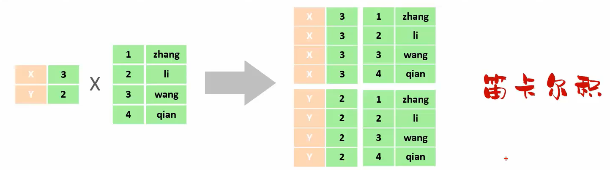
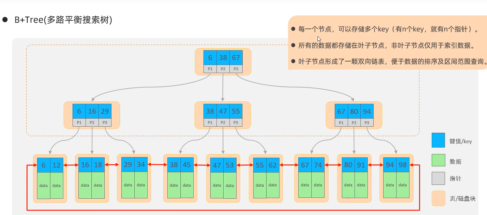
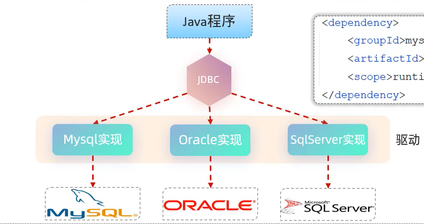
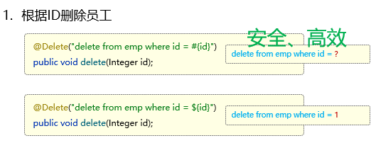
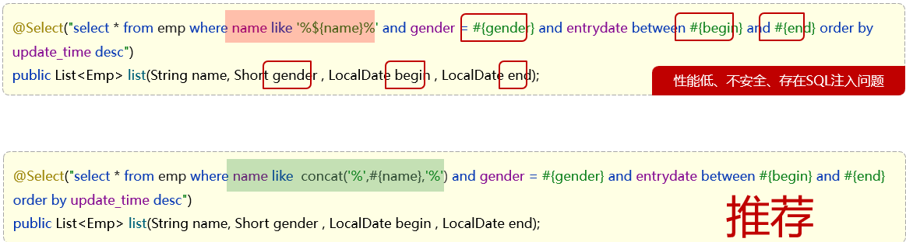
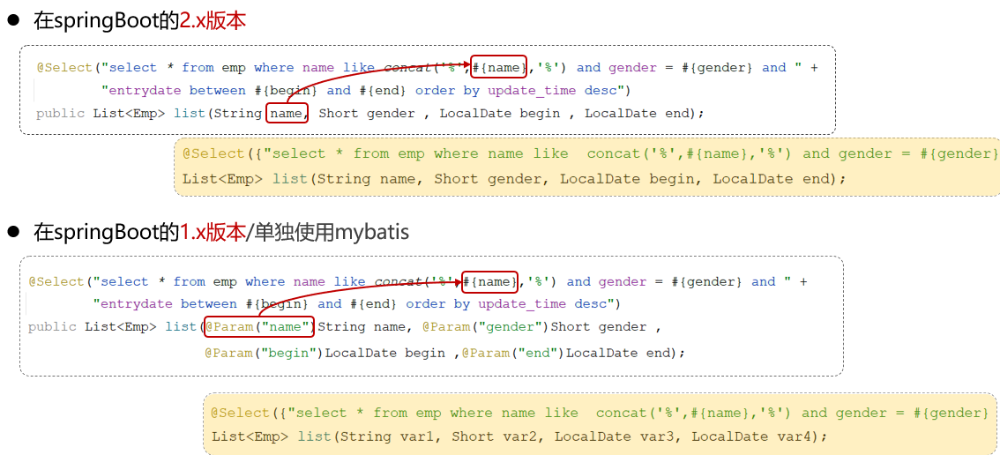
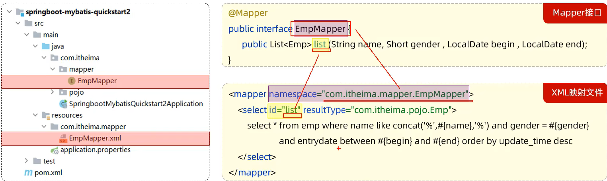
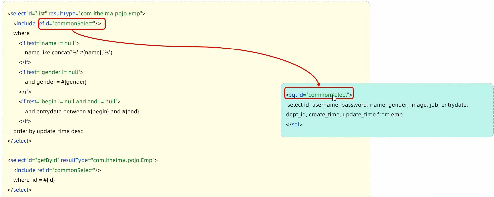

## 多表查询
### 概述
- 多表查询: 指从多张表中查询数据
- *笛卡尔积*: 笛卡尔乘积是指在数学中，两个集合(A 集合 和 B 集合)的所有组合情况。(在多表查询时，***需要消除无效的笛卡尔积***)

#### 分类
1. **连接查询**
    - 内连接：相当于查询 A、B 交集部分数据
    - 外连接
        - 左外连接：查询左表所有数据(包括两张表交集部分数据) -> 如果左表包含空值，也会被展示在查询结果中。
        - 右外连接：查询右表所有数据(包括两张表交集部分数据)
2. **子查询**
#### 内连接
语法：
- 隐式内连接：`select  字段列表   from   表1 , 表2   where   条件 ... `;
- 显式内连接：`select  字段列表   from   表1  [ inner ]  join 表2  on  连接条件 ... `;

使用了别名的多表查询：
```sql
select emp.name , dept.name
from tb_emp emp inner join tb_dept dept
on emp.dept_id = dept.id;
```

注意事项:

一旦为表起了别名，就不能再使用表名来指定对应的字段了，此时只能够使用别名来指定字段。

#### 外连接
语法：
- 左外连接：`select  字段列表   from   表1  left  [ outer ]  join 表2  on 连接条件 ... ;`
- 右外连接：`select  字段列表   from   表1  right  [ outer ]  join 表2  on  连接条件 ... ;`

#### 子查询
1. 概述
    - 介绍：SQL 语句中嵌套 select 语句，称为嵌套查询，又称子查询。
    - 形式：`select  *  from   t1   where  column1 =  ( select  column1  from  t2  … );`
    - 子查询外部的语句可以是 `insert / update / delete / select` 的任何一个，最常见的是 `select`。
2. 分类
    - 标量子查询：子查询返回的结果为*单个值*
    - 列子查询：子查询返回的结果为一列
    - 行子查询：子查询返回的结果为一行
    - 表子查询：子查询返回的结果为多行多列
3. 标量子查询
    - 子查询返回的结果是单个值（数字、字符串、日期等），最简单的形式
    - 常用的操作符：=   <>    >     >=     <    <=      
4. 列子查询
    - 子查询返回的结果是一列（可以是多行）
    - 常用的操作符：`in  、not in` 等
5. 行子查询
    - 子查询返回的结果是一行（可以是多列）。
    - 常用的操作符：`=  、<> 、in 、not  in`


**案例：查询与"韦一笑"的入职日期及职位都相同的员工信息** 

> 可以拆解为两步进行： 
>
> 1. 查询 "韦一笑" 的入职日期 及 职位
> 2. 查询与"韦一笑"的入职日期及职位相同的员工信息 

```mysql
-- 查询"韦一笑"的入职日期 及 职位
select entrydate , job from tb_emp where name = '韦一笑';  #查询结果： 2007-01-01 , 2
-- 查询与"韦一笑"的入职日期及职位相同的员工信息
select * from tb_emp where (entrydate,job) = ('2007-01-01',2);

-- 合并以上两条SQL语句
select * from tb_emp where (entrydate,job) = (select entrydate , job from tb_emp where name = '韦一笑');
```


1. 表子查询
    - 子查询返回的结果是多行多列，常作为临时表
    - 常用的操作符：`in`


## 事务
### 介绍 & 操作
1. 概念：事务 是*一组操作的集合*，它是一个不可分割的工作单位。事务会把*所有的操作作为一个整体一起向系统提交或撤销操作请求*，即这些操作 要么同时成功，要么同时失败。
2. 注意事项： 默认 MySQL 的事务是自动提交的，也就是说，当执行一条 DML 语句，MySQL 会立即隐式的提交事务。
3. 操作
    - 开启事务：`start transaction;  /  begin ;`
    - 提交事务：`commit;`
    - 回滚事务：`rollback;`

使用事务控制删除部门和删除该部门下的员工的操作：

```sql
-- 开启事务
start transaction ;

-- 删除学工部
delete from tb_dept where id = 1;

-- 删除学工部的员工
delete from tb_emp where dept_id = 1;
```

- 上述的这组SQL语句，如果如果执行成功，则提交事务

```sql
-- 提交事务 (成功时执行)
commit ;
```

- 上述的这组SQL语句，如果如果执行失败，则回滚事务

```sql
-- 回滚事务 (出错时执行)
rollback ;
```

### 四大特性
四大特性(ACID)
- 原子性（*Atomicity*）：事务是不可分割的*最小单元*，要么全部成功，要么全部失败
- 一致性（*Consistency*）：事务完成时，必须使所有的数据都保持一致状态
- 隔离性（*Isolation*）：数据库系统提供的隔离机制，保证事务在不受外部并发操作影响的独立环境下运行
- 持久性（*Durability*）：事务一旦提交或回滚，它对数据库中的数据的改变就是永久的

## 索引
### 介绍
索引（index）是帮助数据库 高效获取数据 的 数据结构 。

**优缺点：**
- 优点
    - *提高数据查询的效率*，降低数据库的 IO 成本。
    - 通过索引列对数据进行排序，降低数据排序的成本，降低 CPU 消耗。
- 缺点
    - 索引会占用存储空间。
    - 索引大大提高了查询效率，同时却也降低了 `insert、update、delete` 的效率。
![[Pasted image 20241229215233.png]]
添加索引后查询：

~~~mysql
-- 添加索引
create index idx_sku_sn on tb_sku (sn);  #在添加索引时，也需要消耗时间

-- 查询数据（使用了索引）
select * from tb_sku where sn = '100000003145008';
~~~


### 结构
MySQL 数据库支持的索引结构有很多，如：Hash 索引、B+Tree 索引、Full-Text 索引等。我们平常所说的索引，如果没有特别指明，都是指默认的 *B+Tree* 结构组织的索引。
- 大数据量情况下，二叉树、红黑树层级深，检索速度慢。

> 二叉查找树：左边的子节点比父节点小，右边的子节点比父节点大
![[Pasted image 20241229215613.png]]
> 当我们向二叉查找树保存数据时，是按照从大到小(或从小到大)的顺序保存的，此时就会形成一个单向链表，搜索性能会打折扣。
![[Pasted image 20241229215644.png]]

> 可以选择平衡二叉树或者是红黑树来解决上述问题。（红黑树也是一棵平衡的二叉树）
![[Pasted image 20241229215720.png]]
> 但是在Mysql数据库中并没有使用二叉搜索数或二叉平衡数或红黑树来作为索引的结构。

思考：采用二叉搜索树或者是红黑树来作为索引的结构有什么问题？

  

<details>

    <summary>答案</summary>

    最大的问题就是在数据量大的情况下，树的层级比较深，会影响检索速度。因为不管是二叉搜索数还是红黑数，一个节点下面只能有两个子节点。此时在数据量大的情况下，就会造成数的高度比较高，树的高度一旦高了，检索速度就会降低。

</details>

> 说明：如果数据结构是红黑树，那么查询1000万条数据，根据计算树的高度大概是23左右，这样确实比之前的方式快了很多，但是如果高并发访问，那么一个用户有可能需要23次磁盘IO，那么100万用户，那么会造成效率极其低下。所以为了减少红黑树的高度，那么就得增加树的宽度，就是不再像红黑树一样每个节点只能保存一个数据，可以引入另外一种数据结构，一个节点可以保存多个数据，这样宽度就会增加从而降低树的高度。这种数据结构例如BTree就满足。




B+Tree结构：

- 每一个节点，可以存储多个key（有n个key，就有n个指针）
- 节点分为：叶子节点、非叶子节点
  - 叶子节点，就是最后一层子节点，所有的数据都存储在叶子节点上
  - 非叶子节点，不是树结构最下面的节点，用于索引数据，存储的的是：key+指针
- 为了提高范围查询效率，叶子节点形成了一个双向链表，便于数据的排序及区间范围查询


> **拓展：**
>
> 非叶子节点都是由key+指针域组成的，一个key占8字节，一个指针占6字节，而一个节点总共容量是16KB，那么可以计算出一个节点可以存储的元素个数：16*1024字节 / (8+6)=1170个元素。
>
> - 查看mysql索引节点大小：show global status like 'innodb_page_size';    -- 节点大小：16384
>
> 当根节点中可以存储1170个元素，那么根据每个元素的地址值又会找到下面的子节点，每个子节点也会存储1170个元素，那么第二层即第二次IO的时候就会找到数据大概是：1170*1170=135W。也就是说B+Tree数据结构中只需要经历两次磁盘IO就可以找到135W条数据。
>
> 对于第二层每个元素有指针，那么会找到第三层，第三层由key+数据组成，假设key+数据总大小是1KB，而每个节点一共能存储16KB，所以一个第三层一个节点大概可以存储16个元素(即16条记录)。那么结合第二层每个元素通过指针域找到第三层的节点，第二层一共是135W个元素，那么第三层总元素大小就是：135W*16结果就是2000W+的元素个数。
>
> 结合上述分析B+Tree有如下优点：
>
> - 千万条数据，B+Tree可以控制在小于等于3的高度
> - 所有的数据都存储在叶子节点上，并且底层已经实现了按照索引进行排序，还可以支持范围查询，叶子节点是一个双向链表，支持从小到大或者从大到小查找

### 语法
- 创建索引：`create  [ unique ]  index 索引名 on  表名 (字段名, ... ) ;`
- 查看索引：` show  index  from  表名;`
- 删除索引：` drop  index  索引名  on  表名;`
- 注意事项：
    - 主键字段，在建表时，会自动创建主键索引。
    - 添加唯一约束时，数据库实际上会添加唯一索引。


# 第 5 章 MyBatis
- MyBatis是一款优秀的 *持久层*(*dao 层*) 框架，用于**简化 JDBC 的开发**。
- MyBatis 本是 Apache 的一个开源项目 iBatis, 2010 年这个项目由 apache 迁移到了 google code，并且改名为 MyBatis 。2013 年 11 月迁移到 Github。
- 官网：`https://mybatis.org/mybatis-3/zh/index.html`
## Mybatis入门
### 快速入门
现在使用Mybatis操作数据库，就是在Mybatis中编写SQL查询代码，发送给数据库执行，数据库执行后返回结果。逻辑和使用图形化界面一样
Mybatis会把数据库执行的查询结果，使用实体类封装起来（***一行记录对应一个实体类对象***）
![[Pasted image 20241230123306.png]]
![[Pasted image 20241230123325.png]]

![[Pasted image 20241230123506.png]]

1. 准备工作(创建 springboot 工程、数据库表 user、实体类User)
2. 引入 Mybatis 的相关依赖，配置 Mybatis (数据库连接信息)
3. 编写SQL语句(注解/XML)
4. `application.properties` 


**准备工作 + 引入依赖**
> 项目工程创建完成后，自动在pom.xml文件中，导入Mybatis依赖和MySQL驱动依赖

~~~xml
<!-- 仅供参考：只粘贴了pom.xml中部分内容 -->
<dependencies>
        <!-- mybatis起步依赖 -->
        <dependency>
            <groupId>org.mybatis.spring.boot</groupId>
            <artifactId>mybatis-spring-boot-starter</artifactId>
            <version>2.3.0</version>
        </dependency>

        <!-- mysql驱动包依赖 -->
        <dependency>
            <groupId>com.mysql</groupId>
            <artifactId>mysql-connector-j</artifactId>
            <scope>runtime</scope>
        </dependency>
        
        <!-- spring单元测试 (集成了junit) -->
        <dependency>
            <groupId>org.springframework.boot</groupId>
            <artifactId>spring-boot-starter-test</artifactId>
            <scope>test</scope>
        </dependency>
</dependencies>
~~~

**创建用户表和实体类User，注意表的列名和实体类的属性名要一一对应才能自动映射**

```sql
-- 用户表
create table user(
    id int unsigned primary key auto_increment comment 'ID',
    name varchar(100) comment '姓名',
    age tinyint unsigned comment '年龄',
    gender tinyint unsigned comment '性别, 1:男, 2:女',
    phone varchar(11) comment '手机号'
) comment '用户表';

-- 测试数据
insert into user(id, name, age, gender, phone) VALUES (null,'白眉鹰王',55,'1','18800000000');
insert into user(id, name, age, gender, phone) VALUES (null,'金毛狮王',45,'1','18800000001');
insert into user(id, name, age, gender, phone) VALUES (null,'青翼蝠王',38,'1','18800000002');
insert into user(id, name, age, gender, phone) VALUES (null,'紫衫龙王',42,'2','18800000003');
insert into user(id, name, age, gender, phone) VALUES (null,'光明左使',37,'1','18800000004');
insert into user(id, name, age, gender, phone) VALUES (null,'光明右使',48,'1','18800000005');
```

**配置MyBatis**
![[Pasted image 20241230124459.png]]
> 连接数据库的四大参数：
>
> - MySQL驱动类 
> - 登录名
> - 密码
> - 数据库连接字符串

基于上述分析，在Mybatis中要连接数据库，同样也需要以上4个参数配置。
在springboot项目中，可以编写`resources.application.properties` 文件，配置数据库*连接信息*。我们要连接数据库，就需要配置数据库连接的基本信息，包括：driver-class-name、url 、username，password。

```java
spring.datasource.driver-class-name=com.mysql.cj.jdbc.Driver
spring.datasource.url=jdbc:mysql://localhost:3306/mybatis
spring.datasource.username=root
spring.datasource.password=1234
```


**编写sql语句**
在创建出来的springboot工程中，在引导类所在包下，在创建一个包 mapper。在mapper包下创建一个接口 UserMapper ，这是一个持久层接口（Mybatis的持久层接口规范一般都叫 XxxMapper）。
Mapper 包相当于三层架构中的 Dao 包，同样需要单独创建、。
![[Pasted image 20241230124727.png]]
```java
@Mapper // 在运行时会自动创建该接口的 实现类对象（代理对象），并将该对象交给IOC容器管理
public interface UserMapper {
// 查询全部用户信息 --> List
	@Select("select *  from user")
	public List<User> list();
	}
```
> `@Mapper` 注解：表示是mybatis中的Mapper接口
>
> 	- 程序运行时：框架会*自动生成接口的实现类对象*(代理对象)，并给交Spring的IOC容器管理 --> 不需要我们手动创建实现类
>
>  @Select注解：代表的就是select查询，用于书写select查询语句

**单元测试**
在创建出来的SpringBoot工程中，在src下的test目录下，已经自动帮我们创建好了测试类 ，并且在测试类上已经添加了注解 @SpringBootTest，代表该测试类已经与SpringBoot整合。 

该测试类在运行时，会自动通过引导类加载Spring的环境（IOC容器）。我们*要测试那个bean对象*，就可以直接通过`@Autowired`注解直接将其注入进行，然后就可以测试了。 这样就能解决接口无法创建对象的问题。

测试类代码如下： 

```java
@SpringBootTest
public class MybatisQuickstartApplicationTests {
	
    @Autowired
    private UserMapper userMapper;
	
    @Test
    public void testList(){
        List<User> userList = userMapper.list();
        userList.stream().forEach(user ->{
            System.out.println(user);
        });
    }

}
```

**注意：**
在注解的value中写sql语句容易出错，这是因为IDE不会检测这部分的语法。

**解决方案**：在Idea中配置MySQL数据库连接
![[Pasted image 20241230132442.png]]

### JDBC介绍
- *JDBC*： ( Java Data Base Connectivity )，就是使用Java语言操作关系型数据库的一套API。

#### 本质
- sun 公司官方定义的一套操作所有关系型数据库的规范，即接口（API），并没有实现。
- 各个*数据库厂商*去实现这套接口，提供数据库驱动 jar 包。
- 我们可以使用这套接口（JDBC）编程，真正执行的代码是驱动 jar 包中的实现类。


#### 代码
下面我们看看原始的JDBC程序是如何操作数据库的。操作步骤如下：

1. 注册驱动
2. 获取连接对象
3. 执行SQL语句，返回执行结果
4. 处理执行结果
5. 释放资源

> 在pom.xml文件中已引入MySQL驱动依赖，我们直接编写JDBC代码即可

JDBC具体代码实现：

```java
import com.itheima.pojo.User;
import org.junit.jupiter.api.Test;
import java.sql.Connection;
import java.sql.DriverManager;
import java.sql.ResultSet;
import java.sql.Statement;
import java.util.ArrayList;
import java.util.List;

public class JdbcTest {
    @Test
    public void testJdbc() throws Exception {
        //1. 注册驱动
        Class.forName("com.mysql.cj.jdbc.Driver");

        //2. 获取数据库连接
        String url="jdbc:mysql://127.0.0.1:3306/mybatis";
        String username = "root";
        String password = "1234";
        Connection connection = DriverManager.getConnection(url, username, password);

        //3. 执行SQL
        Statement statement = connection.createStatement(); //操作SQL的对象
        String sql="select id,name,age,gender,phone from user";
        ResultSet rs = statement.executeQuery(sql);//SQL查询结果会封装在ResultSet对象中

        List<User> userList = new ArrayList<>();//集合对象（用于存储User对象）
        //4. 处理SQL执行结果
        while (rs.next()){
            //取出一行记录中id、name、age、gender、phone下的数据
            int id = rs.getInt("id");
            String name = rs.getString("name");
            short age = rs.getShort("age");
            short gender = rs.getShort("gender");
            String phone = rs.getString("phone");
            //把一行记录中的数据，封装到User对象中
            User user = new User(id,name,age,gender,phone);
            userList.add(user);//User对象添加到集合
        }
        //5. 释放资源
        statement.close();
        connection.close();
        rs.close();

        //遍历集合
        for (User user : userList) {
            System.out.println(user);
        }
    }
}
```

> DriverManager(类)：数据库驱动管理类。
>
> - 作用：
>
>   1. 注册驱动
>
>   2. 创建java代码和数据库之间的连接，即获取Connection对象
>
> Connection(接口)：建立数据库连接的对象
>
> - 作用：用于建立java程序和数据库之间的连接
>
> Statement(接口)： 数据库操作对象(执行SQL语句的对象)。
>
> - 作用：用于向数据库发送sql语句
>
> ResultSet(接口)：结果集对象（一张虚拟表）
>
> - 作用：sql查询语句的执行结果会封装在ResultSet中

通过上述代码，我们看到直接基于JDBC程序来操作数据库，代码实现非常繁琐，所以在项目开发中，我们很少使用。  在项目开发中，通常会使用Mybatis这类的高级技术来操作数据库，从而简化数据库操作、提高开发效率。

原始的JDBC程序，存在以下几点问题：

1. 数据库链接的四要素(驱动、链接、用户名、密码)全部*硬编码*在java代码中
2. 查询结果的解析及封装非常繁琐，需要逐个字段按照相应的类型解析
3. 每一次查询数据库都需要获取连接, 操作完毕后释放连接, *资源浪费, 性能降低*

而对于Mybatis来说，我们在开发持久层程序操作数据库时，需要重点关注以下两个方面：

1. application.properties

   ~~~properties
   #驱动类名称
   spring.datasource.driver-class-name=com.mysql.cj.jdbc.Driver
   #数据库连接的url
   spring.datasource.url=jdbc:mysql://localhost:3306/mybatis
   #连接数据库的用户名
   spring.datasource.username=root
   #连接数据库的密码
   spring.datasource.password=1234
~~~

2. Mapper接口（编写SQL语句）--> 使用对象

   ~~~java
   @Mapper
   public interface UserMapper {
       @Select("select id, name, age, gender, phone from user")
       public List<User> list();
   }
~~~


### 数据库连接池
- 程序在启动时，会在数据库连接池(容器)中，创建一定数量的Connection对象

允许应用程序重复使用一个现有的数据库连接，而不是再重新建立一个

- 客户端在执行SQL时，先从连接池中获取一个Connection对象，然后在执行SQL语句，SQL语句执行完之后，释放Connection时就会把Connection对象归还给连接池（Connection对象可以复用）

释放空闲时间超过最大空闲时间的连接，来避免因为没有释放连接而引起的数据库连接遗漏

- 客户端获取到Connection对象了，但是Connection对象并没有去访问数据库(处于空闲)，数据库连接池发现Connection对象的空闲时间 > 连接池中预设的最大空闲时间，此时数据库连接池就会自动释放掉这个连接对象


1. 数据库连接池是个容器，负责分配、管理数据库连接(Connection 对象)
2. 它允许应用程序*重复使用一个现有的数据库连接*，而不是再重新建立一个，类似于***线程池***
3. 释放空闲时间超过最大空闲时间的连接，来避免因为没有释放连接而引起的数据库连接遗漏
4. 优势：
    - 资源重用
    - 提升系统响应速度
    - 避免数据库连接遗漏
#### 创建数据库连接池
需要实现标准接口：DataSource
- 官方(sun)提供了数据库连接池标准（javax.sql.DataSource接口）
  - 功能：获取连接 
    ~~~java
    public Connection getConnection() throws SQLException;
    ~~~

  - 第三方组织必须按照DataSource接口实现

2. 可切换的产品：C3P0、DBCP、*Druid、Hikari*
1. 切换Druid数据库连接池
    ```xml
    <!--方式一：pom.xml 添加依赖-->
    <dependency>
      <groupId>com.alibaba</groupId>
      <artifactId>druid-spring-boot-starter</artifactId>
      <version>1.2.8</version>
    </dependency>
```
```properties
    // 方式二：application.properties
    spring.datasource.druid.driver-class-name=com.mysql.cj.jdbc.Driver
    spring.datasource.druid.url=jdbc:mysql://localhost:3306/mybatis
    spring.datasource.druid.username=root
    spring.datasource.druid.password=1234
```

### lombok
1. Lombok 是一个实用的 Java 类库，能通过*注解的形式自动生成构造器、getter/setter、equals、hashcode、toString等方法*，并可以自动化生成日志变量，简化java开发、提高效率。
2. 添加依赖
    ```xml
    <dependency>
      <groupId>org.projectlombok</groupId>
      <artifactId>lombok</artifactId>
    </dependency>    
    ```
> 通过注解的形式自动生成构造器、getter/setter、equals、hashcode、toString等方法，并可以自动化生成日志变量，简化java开发、提高效率。

| **注解**                | **作用**                                                             |
| --------------------- | ------------------------------------------------------------------ |
| @Getter/@Setter       | 为所有的属性提供get/set方法                                                  |
| @ToString             | 会给类自动生成易阅读的  toString 方法                                           |
| @EqualsAndHashCode    | 根据类所拥有的非静态字段自动重写 equals 方法和  hashCode 方法                           |
| `@Data`               | 提供了更综合的生成代码功能（@Getter  + @Setter + @ToString + @EqualsAndHashCode） |
| `@NoArgsConstructor`  | 为实体类生成无参的构造器方法                                                     |
| `@AllArgsConstructor` | 为实体类生成除了static修饰的字段之外带有各参数的构造器方法。d                                 |
3. 注意事项： Lombok 会在编译时，自动生成对应的 java 代码。我们使用 lombok 时，还需要安装一个 lombok 的插件(idea 自带)。

说明：@Data注解中不包含全参构造方法，通常在实体类上，还会添加上：全参构造、无参构造

~~~java
import lombok.Data;

@Data //getter方法、setter方法、toString方法、hashCode方法、equals方法
@NoArgsConstructor //无参构造
@AllArgsConstructor//全参构造
public class User {
    private Integer id;
    private String name;
    private Short age;
    private Short gender;
    private String phone;
}
~~~

## Mybatis 基础——增删改查
### 准备
1. 查询
   - 根据主键ID查询
   - 条件查询

2. 新增
3. 更新
4. 删除
   - 根据主键ID删除
   - 根据主键ID批量删除

- 1 准备数据库表 emp
- 2 创建一个新的 springboot 工程，选择引入对应的起步依赖（ mybatis、mysql 驱动、lombok ）
- 3 application.properties 中引入数据库连接信息
```properties
    spring.datasource.driver-class-name=com.mysql.cj.jdbc.Driver
    spring.datasource.url=jdbc:mysql://localhost:3306/mybatis
    spring.datasource.username=root
    spring.datasource.password=1234
```
- 4 创建对应的实体类 Emp（实体类属性采用驼峰命名）
    ```java
    @Data
    public class Emp {
        private Integer id;
        private String username;
        private String password;
        private String name;
        private Short gender;
        private String image;
        private Short job;
        private LocalDate entrydate; // 注意日期类型，java vs sql
        private Integer deptId;
        private LocalDateTime createTime;
        private LocalDateTime updateTime;
        }
    ```
vs. 数据库表中采用蛇形命名
![[Pasted image 20241230154722.png]]

- 5 准备Mapper接口 EmpMapper
    ```java
    @Mapper
    public interface EmpMapper {

    }
    ```
### 删除
1. SQL 语法： `delete from emp where id = 17;`
2. 接口方法： 
    ```java
    @Delete("delete from emp where id = #{id}")
    public void delete(Integer id);
    ```
3. 注意事项： 如果 mapper 接口方法*形参*只有一个*普通类型的参数*， `#{…}` 里面的属性名可以随便写，如：`#{id}、#{value}`。
4. 日志输出
    - 可以在 `application.properties` 中，打开 mybatis 的日志，并指定输出到控制台。
```properties
    #指定mybatis输出日志的位置,输出控制台
    mybatis.configuration.log-impl=org.apache.ibatis.logging.stdout.StdOutImpl
```

![[Pasted image 20241230162948.png]]

1. *预编译SQL*，优势
    - 性能更高，只用编译一次，更改 ？ 内内容可以多次执行
    - 更安全(防止SQL注入)
2. SQL 注入： SQL 注入是通过操作输入的数据来修改事先定义好的SQL 语句，以达到执行代码对服务器进行攻击的方法。
![[Pasted image 20241230163041.png]]
> 性能更高：预编译SQL，编译一次之后会将编译后的SQL语句缓存起来，后面再次执行这条语句时，不会再次编译。（只是输入的参数不同）
>
> 更安全(防止SQL注入)：将敏感字进行转义，保障SQL的安全性。

**SQL注入：是通过操作输入的数据来修改事先定义好的SQL语句，以达到执行代码对服务器进行攻击的方法。**

~~~powershell
#启动存在SQL注入的程序
java -jar sql_Injection_demo-0.0.1-SNAPSHOT.jar 
~~~

校验用户登录：是一个简单的查询操作，我们只需要验证用户输入的用户名和密码是否和数据库中的匹配
终端返回的log：
![[Pasted image 20241230163654.png]]

SQL注入（拼接sql语句）：
这里的 where 条件永远都是 True，因为我们将 and 和 or 并列，而 or 后面的表达式永远为真
![[Pasted image 20241230164006.png]]
#### 占位符
1. `#{…}`
    - 执行 SQL 时，会将 `#{…}` 替换为 ?，生成*预编译* SQL，会自动设置参数值。
    - 使用时机：参数传递，都使用 `#{…}` 
2. `${…}`
    - 拼接 SQL。直接将参数拼接在 SQL 语句中，*存在 SQL 注入问题*。
    - 使用时机：如果对表名、列表进行动态设置时使用。
    


### 新增
1. SQL 语句: 

```sql
    insert into emp(username, name, gender, image, job, entrydate, dept_id, create_time, update_time) 
    values ('songyuanqiao','宋远桥',1,'1.jpg',2,'2012-10-09',2,'2022-10-01 10:00:00','2022-10-01 10:00:00');
```
1. 接口方法：
    ```java
    @Insert("insert into emp(username, name, gender, image, job, entrydate, dept_id, create_time, update_time) " +
            "values(#{username}, #{name}, #{gender}, #{image}, #{job}, #{entrydate}, #{deptId}, #{createTime}, #{updateTime})")
    public void insert(Emp emp);

// 测试类中，将创建的 Emp 对象作为 insert 函数的参数
    @Test
    public void testInsert(){
        Emp emp = new Emp();
        emp.setUsername("lalala");
        emp.setName("lalala");
        emp.setImage("1.jpg");
        emp.setGender((short)1);
        emp.setJob((short)1);
        emp.setEntrydate(LocalDate.of(2000,1,1));
        emp.setCreateTime(LocalDateTime.now());
        emp.setUpdateTime(LocalDateTime.now());
        emp.setDeptId(1);
        
        empMapper.insert(emp);
    }
    ```

**开发流程：**
首先在sql console中写出sql代码
然后将sql转换成 java 注解
如果参数数量较多，例如这里的insert语句，那么考虑使用实例将多个参数封装
**注意：#{} 中使用的是属性名，是驼峰命名，而sql中使用的是蛇形**

#### 新增(主键返回)
描述：在数据添加成功后，需要获取插入数据库数据的*主键。*
![[Pasted image 20241230170859.png]]

**业务场景**：在前面讲解到的苍穹外卖菜品与套餐模块的表结构，菜品与套餐是多对多的关系，一个套餐对应多个菜品。既然是多对多的关系，是不是有一张套餐菜品中间表来维护它们之间的关系。

![[Pasted image 20241230170921.png]]

如何实现在插入数据之后返回所插入行的主键值呢？
- 默认情况下，执行插入操作时，是不会主键值返回的。如果我们想要*拿到主键值*，需要在`Mapper`接口中的方法上添加一个`Options`注解，并在注解中指定属性`useGeneratedKeys=true`和`keyProperty="实体类属性名"`

实现：
```java
@Options(keyProperty = "id", useGeneratedKeys = true) // 会自动将生成的主键值，赋值给 emp 对象的 id 属性
@Insert("insert into emp(username, name, gender, image, job, entrydate, dept_id, create_time, update_time) " +       
    "values(#{username}, #{name}, #{gender}, #{image}, #{job}, #{entrydate}, #{deptId}, #{createTime}, #{updateTime})")
public void insert(Emp emp);
```

### 更新
分两步，
- 首先点击”修改“，页面呈现该员工信息
- 然后进行信息修改，点击提交后 ，数据库更新
![[Pasted image 20241230171651.png]]
1. SQL语句(根据**PK ID**更新员工信息)
    ```sql
    update emp set username = 'songdaxia', name = '宋大侠', gender = 1 , image = '1.jpg' , job = 2, entrydate = '2012-01-01', dept_id = 2, update_time = '2022-10-01 12:12:12' where id = 19;
    ```
2. 接口方法
    ```java
    @Update("update emp set username=#{username}, name=#{name}, gender=#{gender}, image=#{image}, job=#{job}, entrydate=#{entrydate}, dept_id=#{deptId}, update_time=#{updateTime} where id=#{id}")
    public void update(Emp emp);
    ```

### 查询
1. SQL 语句： `select *  from emp`
2. 接口方法
    ```java
    @Select("select * from emp where id = #{id}")
    public Emp getById(Integer id);  // 使用 Emp 对象封装查询的数据，而不是集合
    ```
3. 数据封装
    - 实体类*属性名* 和 数据库表查询返回的*字段名*一致，mybatis 会**自动封装**。
    - 如果实体类属性名 和 数据库表查询返回的字段名***不一致，不能自动封装***。
    - ![[Pasted image 20241230173207.png]]
1. 数据封装方法：
    - 1. **起别名：** 在 SQL 语句中，对不一样的列名起别名，别名和实体类属性名一样。 语法： `别名 属性名`
    ```java
    @Select("select id, username, password, name, gender, image, job, entrydate, dept_id deptId, create_time createTime, update_time updateTime from emp where id = #{id} ")
    public Emp getById(Integer id);
    ```
    - 2. **手动结果映射：** 通过 `@Results`及`@Result` 进行手动结果映射。
	    - 注意只需要对不一致的属性名和字段名就行
    ```java
    @Select("select * from emp where id = #{id}")
    @Results({
        @Result(column = "dept_id", property = "deptId"), // 字段名 属性名
        @Result(column = "create_time", property = "createTime"),
        @Result(column = "update_time", property = "updateTime")})
    public Emp getById(Integer id);
    ```
    - 3. ***开启驼峰命名*：** （推荐)如果字段名与属性名符合驼峰命名规则， mybatis 会自动通过驼峰命名规则映射。

```properties
    #开启驼峰命名自动映射，即从数据库字段名 a_column 映射到Java 属性名 aColumn。
    mybatis.configuration.map-underscore-to-camel-case=true
```
#### 查询（条件查询）
- SQL 语法： `select *  from emp where name like '%张%' and gender = 1 and entrydate between '2010-01-01' and '2020-01-01 ' order by update_time`
- 接口方法
    
    - 这里不能用预编译的SQL，而是使用sql语句拼接（$）, 但是这样不安全，因此采用第二种方案：- 使用MySQL提供的字符串拼接函数：concat('%' , '关键字' , '%')
按照条件查询，返回的可能是多条记录，所以用 List，泛型是 Emp

```java
@Select("select *  from emp where name like concat('%', #{name}, '%') and gender = #{gender} and entrydate between #{begin} and #{end} order by update_time")
    public List<Emp> list(String name, Short gender, LocalDate begin, LocalDate end);
```


- 参数名说明


### XML 映射文件 （复杂sql语句建议使用xml）
规范：

> [!NOTE]
> - XML 映射文件的名称与 *Mapper 接口*名称一致，并且将 XML 映射文件和 Mapper 接口放置在相同包下（*同包同名*）。放到 resource 文件目录下
> - XML 映射文件的 *namespace* 属性为 Mapper 接口全限定名一致。
> - XML 映射文件中 sql 语句的 id 与 Mapper  接口中的*方法名*一致，并保持返回类型一致。
> 	- 注意，resulttype指的是单条记录所对应的类

- `<select id=“abc” resultType=“com.itheima.pojo.Emp”>` // 单条记录所封装的类型

- MybatisX 是一款基于 IDEA 的快速开发Mybatis的插件，为效率而生。
- 使用 Mybatis 的注解，主要是来完成一些简单的增删改查功能。如果需要实现复杂的 SQL 功能，建议使用 XML 来配置映射语句。
- 官方说明：https://mybatis.net.cn/getting-started.html
## Mybatis 动态 SQL
### 动态 SQL
在页面原型中，列表上方的条件是动态的，是可以不传递的，也可以只传递其中的1个或者2个或者全部。而在我们刚才编写的SQL语句中，我们会看到，我们将三个条件直接写死了。 如果页面只传递了参数姓名name 字段，其他两个字段 性别 和 入职时间没有传递，那么这两个参数的值就是null。
![[Pasted image 20241231153911.png]]
正确的做法应该是：传递了参数，再组装这个查询条件；如果没有传递参数，就不应该组装这个查询条件。

随着用户的输入或外部条件的变化而变化的 SQL 语句，我们称为 动态 SQL。


示例：把SQL语句改造为动态SQL方式

- 原有的SQL语句

~~~xml
<select id="list" resultType="com.itheima.pojo.Emp">
        select * from emp
        where name like concat('%',#{name},'%')
              and gender = #{gender}
              and entrydate between #{begin} and #{end}
        order by update_time desc
</select>
~~~

- 动态SQL语句

~~~xml
<select id="list" resultType="com.itheima.pojo.Emp">
        select * from emp
        where
    
             <if test="name != null">
                 name like concat('%',#{name},'%')
             </if>
             <if test="gender != null">
                 and gender = #{gender}
             </if>
             <if test="begin != null and end != null">
                 and entrydate between #{begin} and #{end}
             </if>
    
        order by update_time desc
</select>
~~~
测试方法：

~~~java
@Test
public void testList(){
    //性别数据为null、开始时间和结束时间也为null
    List<Emp> list = empMapper.list("张", null, null, null);
    for(Emp emp : list){
        System.out.println(emp);
    }
}
~~~

### `<if>`
- `<if>`：用于判断条件是否成立。使用test属性进行条件判断，如果条件为true，则拼接SQL。
- `<where>`：使用`<where>`标签代替SQL语句中的where关键字，where 元素只会在子元素有内容的情况下才插入where子句。而且会自动去除子句的开头的 AND 或 OR。
~~~xml
<select id="list" resultType="com.itheima.pojo.Emp">
        select * from emp
        <where>
             <!-- if做为where标签的子元素 -->
             <if test="name != null">
                 and name like concat('%',#{name},'%')
             </if>
             <if test="gender != null">
                 and gender = #{gender}
             </if>
             <if test="begin != null and end != null">
                 and entrydate between #{begin} and #{end}
             </if>
        </where>
        order by update_time desc
</select>
~~~

#### 案例：完善更新员工功能，修改为动态更新员工数据信息

- 动态更新员工信息，如果更新时**传递有值，则更新；如果更新时没有传递值，则不更新**
- 解决方案：动态SQL

修改Mapper接口：

~~~java
@Mapper
public interface EmpMapper {
    //删除@Update注解编写的SQL语句
    //update操作的SQL语句编写在Mapper映射文件中
    public void update(Emp emp);
}
~~~

修改Mapper映射文件：

~~~xml
<?xml version="1.0" encoding="UTF-8" ?>
<!DOCTYPE mapper
        PUBLIC "-//mybatis.org//DTD Mapper 3.0//EN"
        "https://mybatis.org/dtd/mybatis-3-mapper.dtd">
<mapper namespace="com.itheima.mapper.EmpMapper">

    <!--更新操作-->
    <update id="update">
        update emp
        set
            <if test="username != null">
                username=#{username},
            </if>
            <if test="name != null">
                name=#{name},
            </if>
            <if test="gender != null">
                gender=#{gender},
            </if>
            <if test="image != null">
                image=#{image},
            </if>
            <if test="job != null">
                job=#{job},
            </if>
            <if test="entrydate != null">
                entrydate=#{entrydate},
            </if>
            <if test="deptId != null">
                dept_id=#{deptId},
            </if>
            <if test="updateTime != null">
                update_time=#{updateTime}
            </if>
        where id=#{id}
    </update>

</mapper>
~~~
测试方法：

~~~java
@Test
public void testUpdate2(){
        //要修改的员工信息
        Emp emp = new Emp();
        emp.setId(20);
        emp.setUsername("Tom111");
        emp.setName("汤姆111");

        emp.setUpdateTime(LocalDateTime.now());

        //调用方法，修改员工数据
        empMapper.update(emp);
}
~~~

> 执行的SQL语句：
![[Pasted image 20241231160754.png]]

再次修改测试方法，观察SQL语句执行情况：

~~~java
@Test
public void testUpdate2(){
        //要修改的员工信息
        Emp emp = new Emp();
        emp.setId(20);
        emp.setUsername("Tom222");
      
        //调用方法，修改员工数据
        empMapper.update(emp);
}
~~~

> 执行的SQL语句：
![[Pasted image 20241231160931.png]]

- `<set>`： 动态地在行首插入sql的 SET 关键字，并会*删掉额外的逗号*。（用在update语句中） ctr + alt + l 格式化 SQL 语句

![[pictures/java_web入门第5天09.png]]

### `<foreach>`
案例：员工删除功能（既支持删除单条记录，又支持批量删除）
![[Pasted image 20241231161200.png]]

- SQL 语法： `delete from emp where id in (1,2,3);`
- 接口方法：
    ```java
    //批量删除
    public void deleteByIds(List<Integer>  ids);
    ```
- XML 映射文件
    ```xml
    <delete id="deleteByIds">
      delete from emp where id in
      <foreach collection="ids" item="id" separator="," open="(" close=")">
        #{id}
      </foreach>
    </delete>
    ```
- 属性
    - collection：集合名称，和接口方法中的参数名一致
    - item：集合遍历出来的元素/项
    - separator：每一次遍历使用的分隔符，拼接时使用的分隔符
    - open：遍历开始前拼接的片段
    - close：遍历结束后拼接的片段
### `<sql><include>`
我们可以对重复的代码片段进行抽取，将其通过`<sql>`标签封装到一个SQL片段，然后再通过`<include>`标签进行引用。

- `<sql>`：定义可重用的SQL片段
- `<include>`：通过属性refid，指定包含的SQL片段



SQL片段： 抽取重复的代码

```xml
<sql id="commonSelect">
 	select id, username, password, name, gender, image, job, entrydate, dept_id, create_time, update_time from emp
</sql>
```

然后通过`<include>` 标签在原来抽取的地方进行引用。操作如下：

```xml
<select id="list" resultType="com.itheima.pojo.Emp">
    <include refid="commonSelect"/>
    <where>
        <if test="name != null">
            name like concat('%',#{name},'%')
        </if>
        <if test="gender != null">
            and gender = #{gender}
        </if>
        <if test="begin != null and end != null">
            and entrydate between #{begin} and #{end}
        </if>
    </where>
    order by update_time desc
</select>
```


